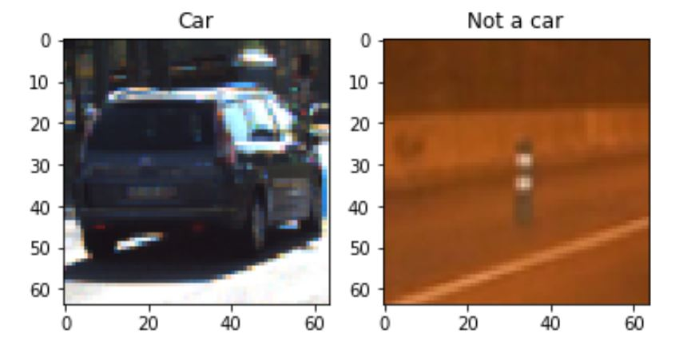
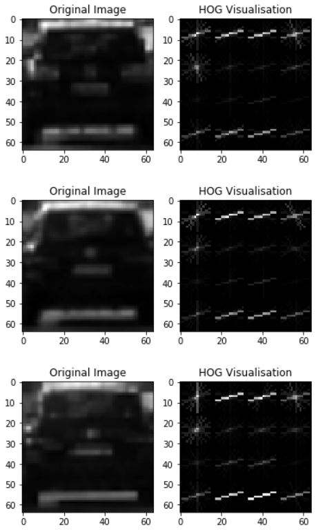
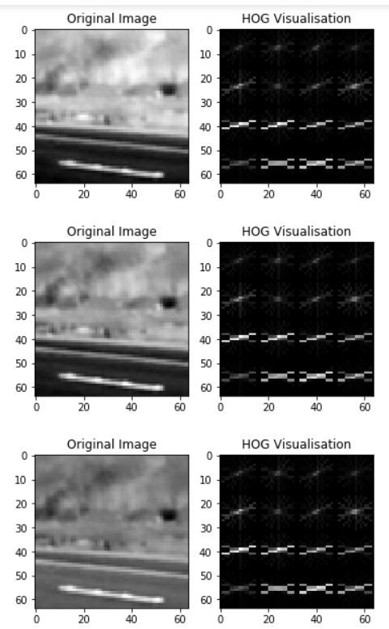
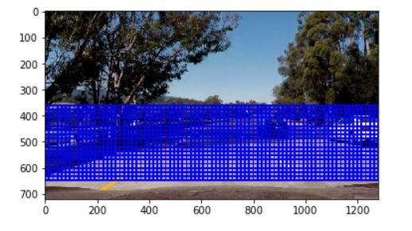
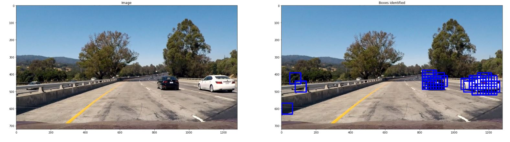
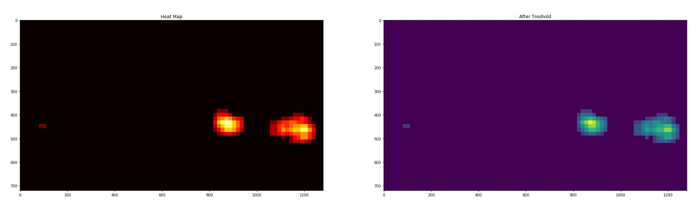
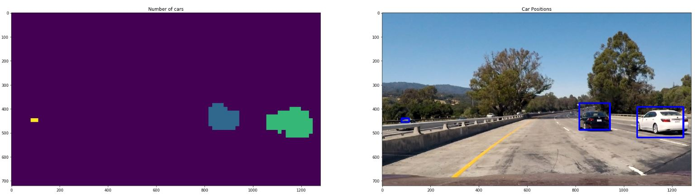
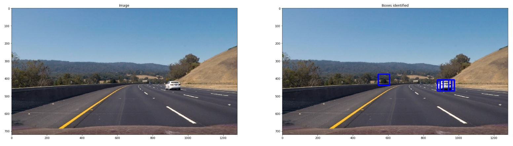
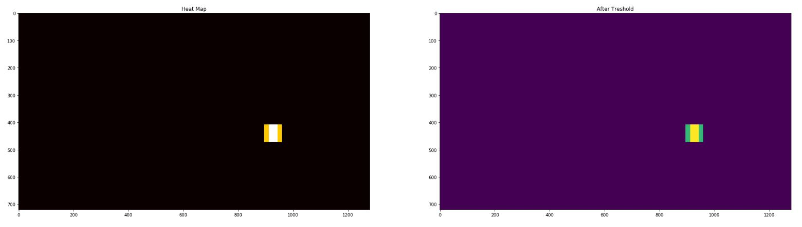
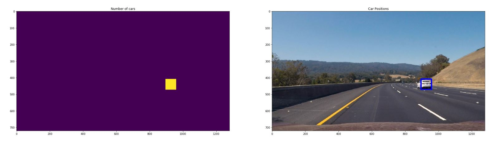

## Writeup Template

The goals / steps of this project are the following:

* Perform a Histogram of Oriented Gradients (HOG) feature extraction on a labeled training set of images and train a classifier Linear SVM classifier
* Optionally, you can also apply a color transform and append binned color features, as well as histograms of color, to your HOG feature vector. 
* Note: for those first two steps don't forget to normalize your features and randomize a selection for training and testing.
* Implement a sliding-window technique and use your trained classifier to search for vehicles in images.
* Run your pipeline on a video stream (start with the test_video.mp4 and later implement on full project_video.mp4) and create a heat map of recurring detections frame by frame to reject outliers and follow detected vehicles.
* Estimate a bounding box for vehicles detected.

### Histogram of Oriented Gradients (HOG)

#### 1. Explain how (and identify where in your code) you extracted HOG features from the training images.

The code for this step is contained in the first code cell of the IPython notebook (or in lines # through # of the file called `some_file.py`).  

I started by reading in all the `vehicle` and `non-vehicle` images.  Here is an example of one of each of the `vehicle` and `non-vehicle` classes:

I then explored different color spaces and different `skimage.hog()` parameters (`orientations`, `pixels_per_cell`, and `cells_per_block`).  I grabbed random images from each of the two classes and displayed them to get a feel for what the `skimage.hog()` output looks like.

Here is an example using the `HSV` color space and HOG parameters of `orientations=8`, `pixels_per_cell=(8, 8)` and `cells_per_block=(2, 2)`:

This is HOG visualization of all three channels of an image of a car. 

This is HOG visualization of all three channels of an image other than car. 

#### 2. Explain how you settled on your final choice of HOG parameters.

Aftertrying different combinations of `orientations` , `pixels_per_cell`, and `cells_per_block` (trial/error method), either the accuracy on the test set reduced (on the higher numbers) or the computations time increased (on the lower number).
`orientations` - `8` , `pixels_per_cell` - `8` , and `cells_per_block` - `2`

#### 3. Describe how (and identify where in your code) you trained a classifier using your selected HOG features (and color features if you used them).

A feature vector of color histogram, spatial binning and HOG vector was made using `comb_feature_vec` method in the code. Before feeding the data (X_train), it was normalised using `StandardScalar()` method. X_test test_images were passed into `.trasnform` to normalize them as well with the same `mean` and `standard deviation`.

An experiment of type of classifier was also conducted (image included). `rbf` and `linear` were used with C parameter varying 0.01,0.1,1,10. `rbf` took a really great amount of time to fit and the test accuracy between `rbf` and `linear` was very different (97% & 99%). Therefore, linear SVC was chosen as if was quick and a lot of trial error was to be done to tube other parameters. 
Parameter C was chosen using the `Grid_Search` method as explained in the lessons.
The codes can be found in `extract_features` and `sing_img_features` functions in the code.

### Sliding Window Search

#### 1. Describe how (and identify where in your code) you implemented a sliding window search.  How did you decide what scales to search and how much to overlap windows?

Sliding window search was done using `sliding_win` function. This function requires `image`, `scale to search` and `overlap_window`. 
The sliding starts from `X = 0` to last X i.e. `img.shape[1]`. `y` starts from half of the image `img.shape[0]/2` t0 `650` such that the bonnet of the car is avoided.

Scale was kept to `64x64` and was not played with. Overlap ratio was experimented with and as the overlap ratio was increased false negatives were removed and better detection of cars was seen to be made by the model.

#### 2. Show some examples of test images to demonstrate how your pipeline is working.  What did you do to optimize the performance of your classifier?

The pipeline starts with an windows sliding and identifying the car_like fearures in the image. Once the identificaions is made, boxes are drawn. 

To avoid false positives, heat images are created and lower values are removed.

After playing along with various color spaces, Ultimately I searched on two scales using YCrCb 3-channel HOG features plus spatially binned color and histograms of color in the feature vector, which provided a nice result.  Here are some example images:

### Video Implementation

#### 1. Provide a link to your final video output.  Your pipeline should perform reasonably well on the entire project video (somewhat wobbly or unstable bounding boxes are ok as long as you are identifying the vehicles most of the time with minimal false positives.)

Here's a [link to my video result](./test_videos_output/project_video_out.mp4)

#### 2. Describe how (and identify where in your code) you implemented some kind of filter for false positives and some method for combining overlapping bounding boxes.

Intially there were a lot of false positives in the final image. Many of the false detections were removed as I tried different parameters and colorspaces. 

But in the pipeline, to avoid the false positives, a series of heat_mapping functions were used which detect the boxes and count the number of overlapping boxes at each pixel and then label them separately. They finally draw boxes at the min-max locations of X's and Y's making a rectangle with opposite vertices.

All these are done in `heat_map` , `heat_threshold`and `heat_box` functions repectively.

### Here is another example describing the false detection elminiation:

### Here is the output of `scipy.ndimage.measurements.label()` on the integrated heatmap from all six frames and
### the resulting bounding boxes are drawn onto the last frame in the series:

### Discussion

#### 1. Briefly discuss any problems / issues you faced in your implementation of this project.  Where will your pipeline likely fail?  What could you do to make it more robust?

This pipeline had a good number of hyper parameters. Finding a good combination of these hyper parameters that give a good result was as  frustrating task. 

Even after finding the combination, these pipline may fail in dark regions. This may also fail when there is a uphill road/downhill road. All the images and video were of daylight. A good test would be to test the algorithm on a night test.

Therefore, if I take this project further, I would test it on a night driving video.

Option to make it more robust: 

    1) Using 2 best color spaces (one for day, other for night), and take the average of them. Changing the heat_threshold accordingly. This would again require more data to train the classifier.
    
    2) Using average over some frames to avoid flickering.
